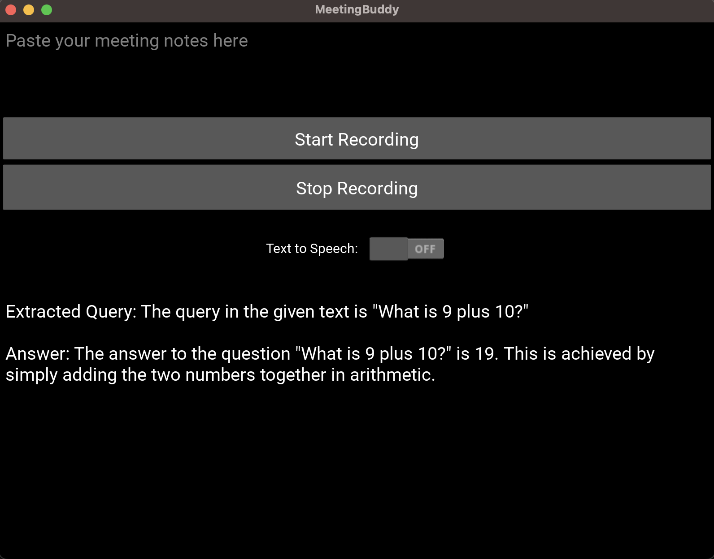

# Meeting-Buddy


automate answering in live meetings by generating readable scripts on the fly

## Installation and Setup

### MacOs

```
brew install portaudio ffmpeg
pipenv shell
pipenv install
```

create a .env file with the following:

```
OPENAI_API_KEY = "Your OpenAI API token"
```

## Voice Cloning Text to Speech Pipeline

read more at: [Voice Cloning Readme](voice_cloning/README.md)

## Demo Image



## TODOs

There is a lot to do. This is a very bare bones app and a lot of the code is messy and needs to be refactored.
